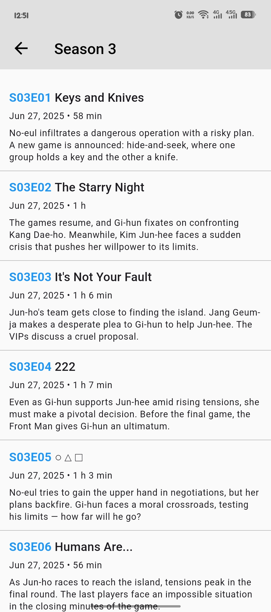

# Netflix Clone

A cross-platform Netflix Clone built with [Flutter](https://flutter.dev/).  
This project demonstrates a modern, responsive UI and integrates with real APIs to showcase movies, TV shows, and streaming features.
---

## 🚀 Features

- Browse trending, popular, and recommended movies & TV shows
- Detailed movie/show pages with trailers, cast, and descriptions
- Search functionality
- Smooth animations and transitions
- Dark mode support

# Screenshots
<p align="center">
  
  
  
  
  
  
  
  
  
  
  
  
  
  
  
  
  
  
  
  
  
  
  
  
  
  
  
</p>


## 📱 Platforms

- Android
- iOS
- Linux (GTK)
- Web (if enabled)

## 🛠️ Getting Started

### Prerequisites

- [Flutter SDK](https://docs.flutter.dev/get-started/install)
- [Dart SDK](https://dart.dev/get-dart)
- Android Studio/Xcode/VS Code (recommended)
- Emulator or physical device

### Installation

1. **Clone the repository:**
   ```sh
   git clone https://github.com/yourusername/netflix-clone-flutter.git
   cd netflix-clone-flutter
   ```

2. **Install dependencies:**
   ```sh
   flutter pub get
   ```

3. **Run the app:**
   ```sh
   flutter run
   ```
   > You can specify the platform with `-d` (e.g., `flutter run -d linux`).

### Building for Release

- **Android:**  
  `flutter build apk --release`
- **iOS:**  
  `flutter build ios --release`
- **Linux:**  
  `flutter build linux --release`

## 🧪 Running Tests

```sh
flutter test
```

## 📂 Project Structure

```
lib/
  main.dart
  screens/
  widgets/
  models/
  services/
assets/
  images/
  icons/
test/
```
## 🤝 Contributing

Contributions are welcome!  
Please open issues and submit pull requests for new features, bug fixes, or improvements.

## 📄 License

This project is licensed under the [MIT License](LICENSE).

---

> Inspired by Netflix.

